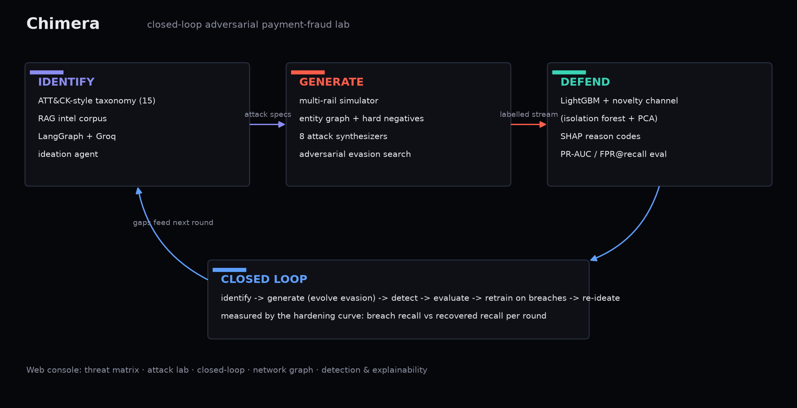

# Chimera

**A closed-loop adversarial lab for GenAI-era payment fraud.** Chimera discovers
emerging fraud vectors, simulates them at fidelity across modern payment rails,
and hardens a detector against them - as one feedback loop, not three separate
pieces. The attacks the system generates become the training data for its own
defence.

Built for the Mastercard Innovation Challenge @ GFF 2026 (AI Defense Lab for
Payment Security). Three pillars, one system: **identify · generate · defend**.



---

## Why this exists

Generative AI made fraud faster, cheaper, and adaptive. Static, rule-based (and
even static ML) defences decay the moment an attacker changes shape. The
challenge asks for a system that treats attack and defence as a single loop.
Chimera does exactly that, and it proves the loop closes with a measurable
**hardening curve**: when a red-team agent evolves evasive campaigns, detection
recall collapses; when the detector retrains on those samples, it recovers.

## What's inside

| Pillar | What it does | Key files |
|---|---|---|
| **Identify** | ATT&CK-style taxonomy of 16 GenAI payment-fraud techniques + a RAG-grounded ideation agent (live on Groq `gpt-oss-120b`, offline fallback) that proposes novel variants. | `backend/chimera/identify/` |
| **Generate** | A multi-rail simulator (card-not-present, real-time A2A, agentic commerce) with realistic distributions, an entity graph, hard negatives, and 9 attack synthesizers. An evolutionary search evolves each attack to evade the live detector. | `backend/chimera/generate/` |
| **Defend** | LightGBM + a novelty channel (isolation forest + PCA) for unseen attacks + an agent-identity feature family for delegated-token abuse, per-event SHAP reason codes, and a cost-aware operating point. | `backend/chimera/defend/` |
| **Loop** | A live multi-agent system: a compiled **LangGraph** `StateGraph` cycles four agents (recon → red_team → attack → blue_team) with a full execution trace. A plain engine shares the same primitives for LLM-free runs. | `backend/chimera/loop/` |
| **Web** | A bespoke Next.js prototype: a scroll-told landing that explains the loop, then a live console (threat matrix, attack lab, hardening curve, transfer graph, detection). | `frontend/` |

## Headline results

Reproduce with `make train && make loop` (numbers are seeded and stable; see
`docs/walkthrough.md` for the full tables and methodology).

- **Closed loop (the headline):** the red team drives aggregate recall from
  72.9% to **19.2%** in one round; retraining on the evasive samples restores it
  to 82.9%, and by round 3 the attacker can no longer find easy evasion. The loop
  converges.
- **Novel/emerging vector:** with delegated-token agent abuse **entirely removed
  from training**, the supervised model catches 14.9% of it - the agent-identity
  features and novelty channel recover **100%**.
- **Detection (held-out test):** ROC-AUC 1.00, PR-AUC 0.9999, F1 0.995 (2 false
  positives on 70,384 legit, 0.003%). This near-perfect in-distribution score is
  *not* the point - it is expected against first-generation campaigns; the credible
  numbers are the real-data validation below. Per-vector recall is honest - the
  deepfake authorised-push vector sits at ~80% by design. The cost-optimal operating
  point recovers 100% of fraud *value* at ~140 alerts per 10k transactions.
- **Validated beyond synthetic:** the same two-channel ensemble scores ROC-AUC
  0.95 / PR-AUC 0.81 on the real ULB credit-card fraud benchmark (284k real
  transactions), and a GraphSAGE GNN lifts coordinated-ring PR-AUC from 0.84 to
  0.998 (`make validate`, `make gnn`).
- **Evaluation rigor** (`scripts/rigor.py`, `scripts/point_in_time.py`,
  `scripts/benchmark_baselines.py`): detection holds point-in-time with no
  look-ahead (PR-AUC 0.9987) and across 5 seeds (recall 0.994 +/- 0.003); a
  component ablation shows the graph features are the decisive lift (0.94 to
  0.9999). Against standard models the static ensemble is only competitive
  (PR-AUC: RF 0.82, LightGBM 0.81, Chimera 0.78) - the contribution is the loop,
  which transfers to real fraud (recall 84% -> 59% under evasion -> 100% after
  retrain). See [docs/CHANGELOG.md](docs/CHANGELOG.md).

> These are results on synthetic-but-realistic data. See
> [Real-world feasibility](docs/walkthrough.md#10-real-world-feasibility) for what
> changes on live payment data and what paid infrastructure buys you.

## The 2026 frontier: agentic-commerce identity abuse

A payment can now be initiated by an autonomous agent on a cardholder's behalf
(Mastercard Agent Pay's Agentic Token; Visa's Trusted Agent Protocol). A hijacked
or malicious agent spends inside someone else's mandate while looking identical to
a legitimate one on velocity, device and cadence. Chimera simulates this
(`AGENT-HIJACK`) and defends it on **credential integrity** - attestation,
directory trust, mandate-cap breach, and agent-id replay structure - the exact
signals those protocols expose. It is the headline new capability.

## Quickstart

```bash
# 0) prerequisites: Python 3.11+, Node 18+, uv (https://docs.astral.sh/uv/)
make setup        # venv + backend (with agents) + frontend deps

# 1) build the defence and the loop artifacts (writes data/artifacts/)
make train        # simulate + train + evaluate + leave-one-out novelty study
make loop         # run the closed adversarial loop -> hardening curve

# 2) run it
make dev          # FastAPI on :8000 + Next.js on :3000  (open http://localhost:3000)
```

The LLM ideation agent is **optional**: without a `GROQ_API_KEY` it runs a
deterministic offline planner, so every command works with zero external
dependencies. To enable live ideation, copy `.env.example` to `backend/.env` and
add a free Groq key. Chimera uses `openai/gpt-oss-120b` / `gpt-oss-20b` (Groq
retired the Llama 3.x endpoints on 17 Jun 2026).

## Reproducibility

Every stochastic component derives its RNG from a single seed (`CHIMERA_SEED`).
The full dataset is never stored - it regenerates bit-for-bit from `(seed,
config)`, recorded in `data/artifacts/sim_meta.json`. `make test` runs a fast
end-to-end suite covering generation, leakage checks, detection, evasion,
taxonomy, RAG and ideation.

## Responsible use

Chimera is defensive tooling. It runs entirely on synthetic data it generates
itself: no real cardholders, PII, credentials, or live payment connectivity. The
attack modules are parameterised statistical patterns (amounts, timing, graph
shape, credential-integrity fields) that stress a detector, not operational
playbooks or working exploit code, and cannot be pointed at a real system. The
red team exists only to harden the blue team.

## Tech

Python · scikit-learn · LightGBM · NetworkX · FastAPI · LangGraph · Groq
(`gpt-oss`, free tier) · Next.js · TypeScript · Tailwind · Framer Motion. Ships as
a single monolithic Docker image (FastAPI serves the static Next export + `/api`),
one Render service, one URL. See [docs/DEPLOY.md](docs/DEPLOY.md).

## Layout

```
backend/chimera/
  identify/   taxonomy, RAG corpus + retriever, ideation agent
  generate/   entities, base traffic, hard negatives, attacks/, simulator, adversarial
  defend/     features (event + velocity + graph + agent-identity), detector, evaluate
  loop/       orchestrator (engine) + graph (LangGraph)
  api/        FastAPI service + server
backend/scripts/   train.py, run_loop.py, analyze.py, build_deck.py
frontend/          Next.js app (scroll-told landing + live console)
docs/              solution walkthrough, deck, screenshots
```
